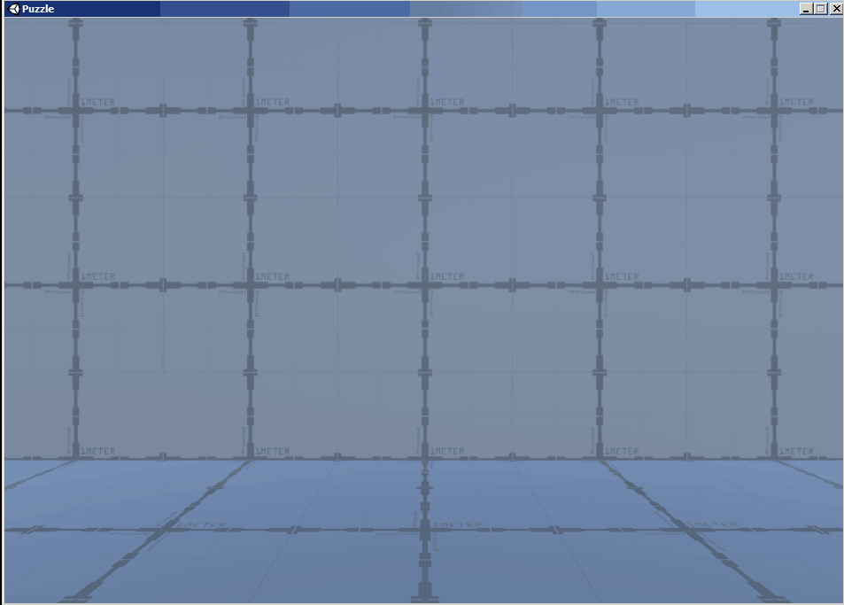
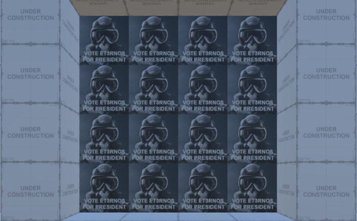
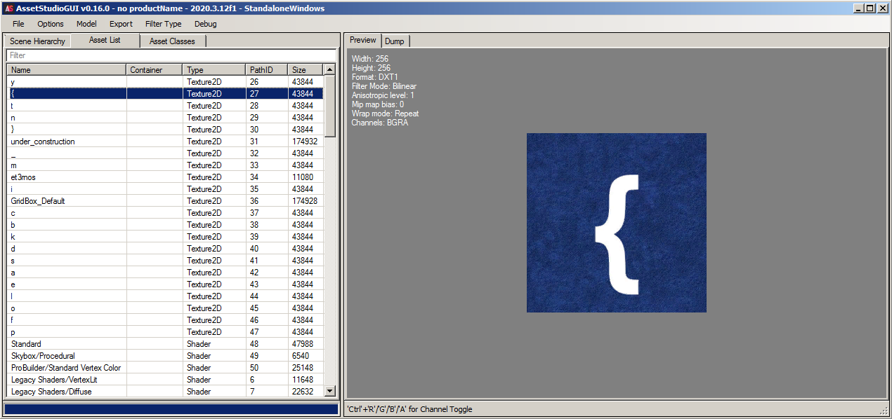
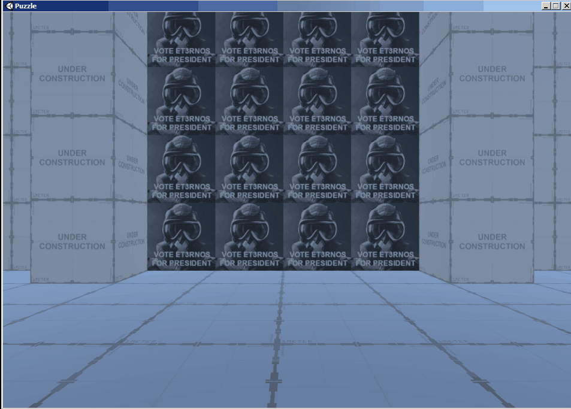

# Puzzle 2

## Challenge

The description given for this challenge was:
```
The evil presidential candidate Et3rnos is now forcing this poor game's players to vote on him in order to access the flag room. Can you teach him a lesson and get access to it without voting on him? The flag is in the format ICTF{[A-Z_]+}
```

Attachments:
```
https://imaginaryctf.org/r/64FA-puzzle_2.zip
```

<br/>

## Walkthrough

Upon inspection of the zip file, it seems that it contains a Unity game that can be run in Windows.

Firing up the game, we can control our movements with the WASD keys and adjust the camera angle by dragging with our mouse. Within the game map, there are several "walls" that are made up of `VOTE FOR ET3RNOS FOR PRESIDENT` blocks.

<p align="center">
    <br/>
</p>

</br>

The "walls" supposedly breaks down when you pass through them except for the one with `UNDER CONSTRUCTION` blocks surrounding it. I believe this is the wall we must pass through in order to access the flag room.

<p align="center">
    <br/>
</p>

</br>

First thing that came to my mind is to try extracting the game assets and see if we can get any textures containing the flag. For this, I used [AssetStudio](https://github.com/Perfare/AssetStudio) and load up the files under `Puzzle_Data` folder to see if I can get anything.

By opening `Puzzle_Data\sharedassets0.assets`, I was able to view the textures used in the game but the flag was broken down into individual letters which doesn't seem to be very useful...

<p align="center">
    <br/>
</p>

</br>

Being stuck, I searched the web and found a [nice guide](https://www.unknowncheats.me/forum/unity/285864-beginners-guide-hacking-unity-games.html) on how to hack Unity games. It seems that we can use a decompiler such as [dnSpy](https://github.com/dnSpy/dnSpy) to load `Puzzle_Data\Managed\Assembly-CSharp.dll` and just modify the game's functions directly.

Personally, I have no experience with Unity and was just browsing through the functions to see if there is anything that I can re-use to make the wall break or my character walk through the wall. Within the file, I found 2 functions that seems to be rather interesting:

Under `CameraController`:
```csharp
	private void Update()
	{
		float yAngle = Input.GetAxis("Mouse X") * this.sensitivity;
		float num = Input.GetAxis("Mouse Y") * this.sensitivity;
		base.transform.parent.Rotate(0f, yAngle, 0f);
		base.transform.Rotate(-num, 0f, 0f);
	}
```

Under `PlayerController`:
```csharp
	private void Move()
	{
		Vector3 vector = default(Vector3);
		if (Input.GetKey(KeyCode.W))
		{
			vector += Vector3.forward;
		}
		if (Input.GetKey(KeyCode.S))
		{
			vector += Vector3.back;
		}
		if (Input.GetKey(KeyCode.D))
		{
			vector += Vector3.right;
		}
		if (Input.GetKey(KeyCode.A))
		{
			vector += Vector3.left;
		}
		vector = this.rb.rotation * vector * this.movementSpeed;
		this.rb.velocity = new Vector3(vector.x, this.rb.velocity.y, vector.z);
	}
```
The `CameraController` seems to rotate the base around, which I assumed to be the map. Thus if I were to add some code to move the map, I should be able to get the flag room? With this in mind, I took reference from the `Move()` function in `PlayerController` and used `base.transform.Transform` to try moving the map around.

Here is the code I added to `Update()` in `CameraController`, which the movements are mapped to the arrow keys:

```csharp
    Vector3 vector = default(Vector3);
    if (Input.GetKey(KeyCode.UpArrow))
    {
        vector += Vector3.forward;
    }
    if (Input.GetKey(KeyCode.DownArrow))
    {
        vector += Vector3.back;
    }
    if (Input.GetKey(KeyCode.RightArrow))
    {
        vector += Vector3.right;
    }
    if (Input.GetKey(KeyCode.LeftArrow))
    {
        vector += Vector3.left;
    }
    base.transform.parent.Translate(vector);
    base.transform.Translate(vector);
```

</br>

After compiling the method and saving the module we try out the patch in-game...

<p align="center">
    <br/>
</p>

Viola! We got out flag!
```
ICTF{SPY_KIDS_ASSEMBLE}
```